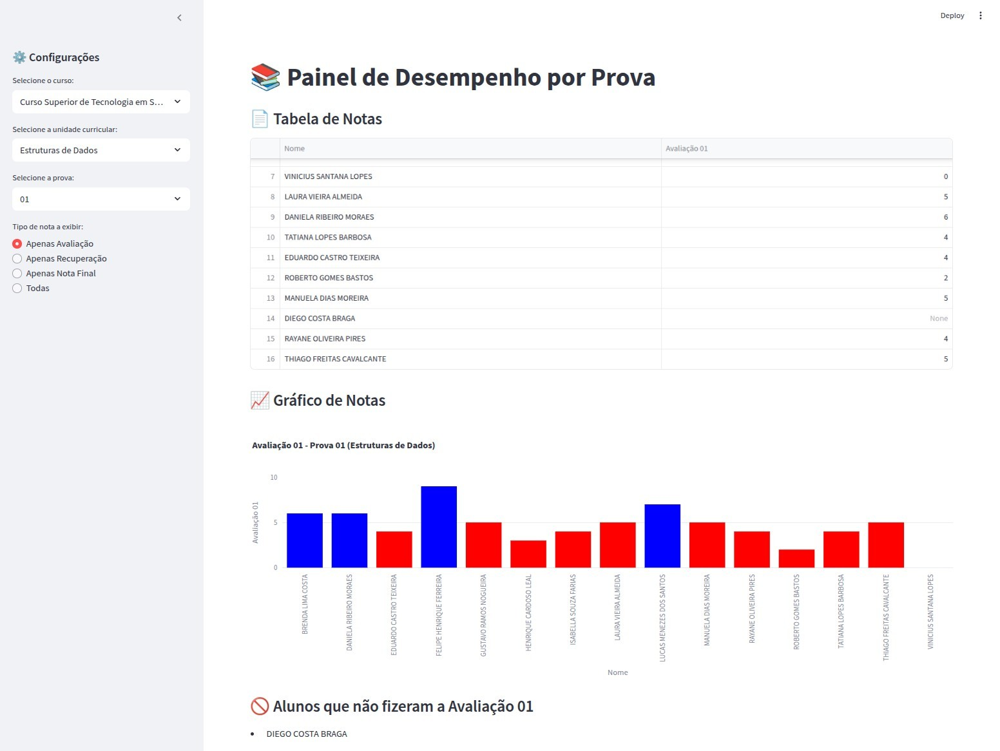

# 📊 Painel de Desempenho por Prova


Um painel interativo desenvolvido em **Streamlit** para análise do desempenho acadêmico de alunos com base em avaliações e recuperações. Os dados são lidos de arquivos `.xlsx`, e os gráficos e estatísticas são atualizados automaticamente conforme a prova e o tipo de nota selecionados.

## 🔧 Funcionalidades

- Seleção dinâmica de curso e unidade curricular (UC)
- Escolha entre múltiplas provas disponíveis
- Exibição de:
  - Tabela de notas (Avaliação, Recuperação e Nota Final)
  - Gráficos de barras por aluno
  - Distribuição das notas com frequência
  - Estatísticas (média, desvio padrão, percentual de aprovação)
  - Ranking por nota
- Identificação de alunos ausentes ou dispensados

## 🚀 Tecnologias Utilizadas

- [Python 3.12](https://www.python.org/)
- [Pandas](https://pandas.pydata.org/)
- [Plotly](https://plotly.com/python/)
- [Streamlit](https://streamlit.io/)

## 🖼️ Exemplo do Painel



## 📁 Estrutura esperada dos dados

O Excel deve conter as colunas:

```
Matrícula | Nome | Avaliação 01 | Recuperação 01 | Avaliação 02 | ...
```

O script automaticamente detecta quantas provas existem (até 4) e calcula a nota final como `max(Avaliação, Recuperação)`.

## ▶️ Como executar localmente

1. Clone este repositório:
   ```bash
   git clone https://github.com/seu-usuario/painel-notas.git
   cd painel-notas
   ```

2. Crie e ative um ambiente virtual:
   ```bash
   python -m venv venv
   source venv/bin/activate  # Linux/Mac
   venv\Scripts\activate     # Windows
   ```

3. Instale as dependências:
   ```bash
   pip install -r requirements.txt
   ```

4. Execute o app:
   ```bash
   streamlit run app.py
   ```

## ☁️ Como publicar no Streamlit Cloud

1. Crie um repositório público no GitHub
2. Faça o push do seu código e arquivos `.xlsx`
3. Acesse [https://streamlit.io/cloud](https://streamlit.io/cloud)
4. Conecte seu repositório e pronto!

## 📄 Licença

Distribuído sob a licença MIT. Veja `LICENSE` para mais informações.
